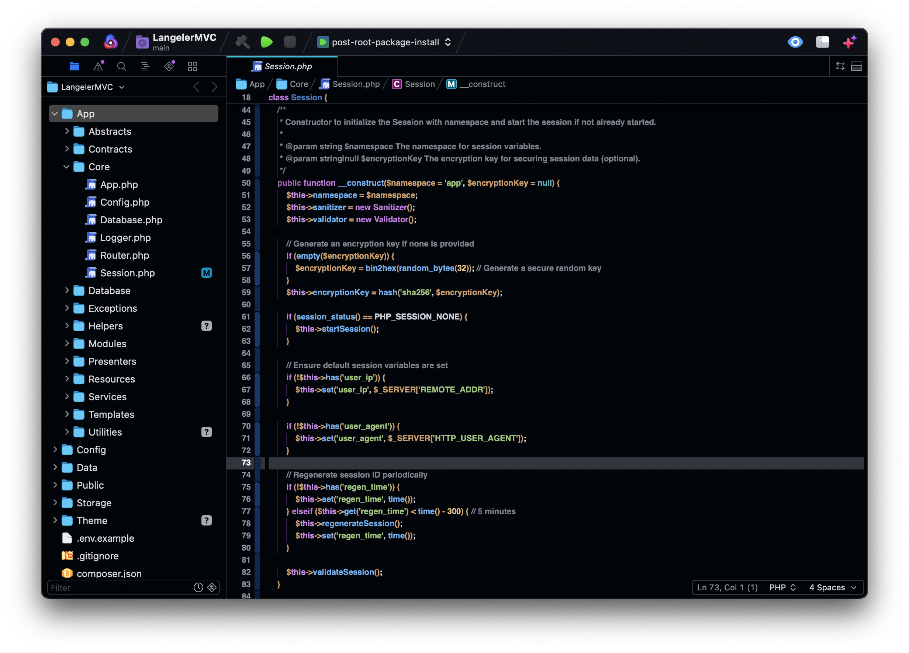
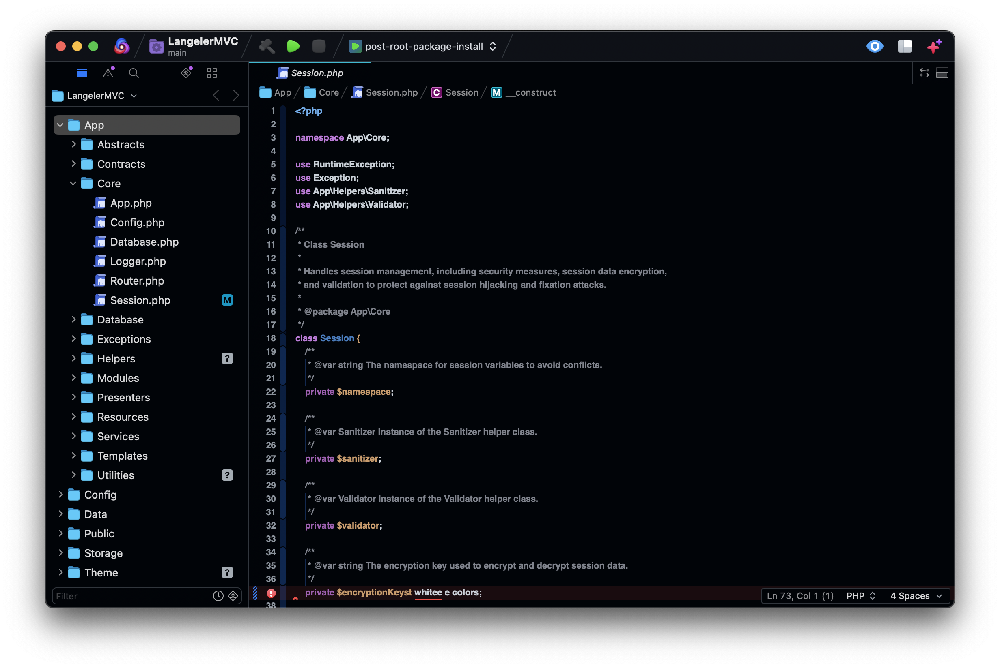

# LangelerNova Directory Structure

```plaintext
LangelerNova/
│
├── colors/
│   ├── interface/
│   │   ├── _base-colors.scss                // Colors for base interface elements (window, titlebar, etc.)
│   │   ├── _button-colors.scss              // Colors for buttons
│   │   ├── _document-colors.scss            // Colors for document (editor)
│   │   ├── _gutter-colors.scss              // Colors for gutter (line numbers, etc.)
│   │   ├── _textfield-colors.scss           // Colors for textfields
│   │
│   ├── languages/
│   │   ├── advphp/
│   │       ├── _advphp_additional-elements-colors.scss // Colors for additional PHP elements
│   │       ├── _advphp_comments-colors.scss        // Colors for Advanced PHP comments
│   │       ├── _advphp_control-structures-colors.scss // Colors for control structures (if, else, etc.)
│   │       ├── _advphp_curl-colors.scss            // Colors for cURL keywords
│   │       ├── _advphp_error-handling-colors.scss  // Colors for error handling (try, catch, throw)
│   │       ├── _advphp_functions-colors.scss       // Colors for Advanced PHP functions
│   │       ├── _advphp_keywords-colors.scss        // Colors for Advanced PHP keywords
│   │       ├── _advphp_magic-constants-colors.scss // Colors for magic constants (e.g., __CLASS__)
│   │       ├── _advphp_namespace-colors.scss       // Colors for Advanced PHP namespaces
│   │       ├── _advphp_objects-colors.scss         // Colors for Advanced PHP objects
│   │       ├── _advphp_sql-colors.scss             // Colors for SQL keywords
│   │       ├── _advphp_statics-colors.scss         // Colors for Advanced PHP statics
│   │       ├── _advphp_strings-colors.scss         // Colors for Advanced PHP strings
│   │       ├── _advphp_syntax-colors.scss          // Colors for Advanced PHP syntax
│   │       ├── _advphp_variables-colors.scss       // Colors for Advanced PHP variables
│   │       ├── _advphp_wordpress-colors.scss       // Colors for WordPress keywords
│   │
│   ├── syntax/
│   │   ├── _brackets-colors.scss            // Colors for brackets
│   │   ├── _cdata-colors.scss               // Colors for CDATA sections
│   │   ├── _comments-colors.scss            // Colors for syntax comments
│   │   ├── _declarations-colors.scss        // Colors for declarations
│   │   ├── _definitions-colors.scss         // Colors for definitions (classes, functions, etc.)
│   │   ├── _identifiers-colors.scss         // Colors for identifiers (variables, functions, etc.)
│   │   ├── _invalid-colors.scss             // Colors for invalid syntax
│   │   ├── _keywords-colors.scss            // Colors for syntax keywords
│   │   ├── _markup-colors.scss              // Colors for markup (non-tag elements)
│   │   ├── _operators-colors.scss           // Colors for operators
│   │   ├── _processing-colors.scss          // Colors for processing directives
│   │   ├── _regex-colors.scss               // Colors for regex
│   │   ├── _strings-colors.scss             // Colors for strings
│   │   ├── _style-colors.scss         // Colors for stylesheet elements (CSS selectors, properties)
│   │   ├── _tags-colors.scss                // Colors for markup tags (HTML, XML)
│   │   ├── _values-colors.scss              // Colors for values (numbers, booleans, etc.)
│   │
│   ├── terminal/
│   │   ├── _terminal-colors.scss            // Colors for terminal elements (ANSI colors)
│   │
│   ├── _core-colors.scss                    // Core color definitions used across all sections
│
├── sections/
│   ├── interface/
│   │   ├── _base.scss                       // Styles for base interface elements (window, titlebar, etc.)
│   │   ├── _buttons.scss                    // Styles for buttons
│   │   ├── _document.scss                   // Styles for document-related elements (editor)
│   │   ├── _gutter.scss                     // Styles for gutter elements (line numbers, etc.)
│   │   ├── _textfields.scss                 // Styles for textfields
│   │
│   ├── languages/
│   │   ├── advphp/
│   │       ├── _advphp_additional-elements.scss    // Styles for additional PHP elements
│   │       ├── _advphp_comments.scss               // Styles for Advanced PHP comments
│   │       ├── _advphp_control-structures.scss     // Styles for control structures (if, else, etc.)
│   │       ├── _advphp_curl.scss                   // Styles for cURL keywords
│   │       ├── _advphp_error-handling.scss         // Styles for error handling (try, catch, throw)
│   │       ├── _advphp_functions.scss              // Styles for Advanced PHP functions
│   │       ├── _advphp_keywords.scss               // Styles for Advanced PHP keywords
│   │       ├── _advphp_magic-constants.scss        // Styles for magic constants (e.g., __CLASS__)
│   │       ├── _advphp_namespace.scss              // Styles for Advanced PHP namespaces
│   │       ├── _advphp_objects.scss                // Styles for Advanced PHP objects
│   │       ├── _advphp_sql.scss                    // Styles for SQL keywords
│   │       ├── _advphp_statics.scss                // Styles for Advanced PHP statics
│   │       ├── _advphp_strings.scss                // Styles for Advanced PHP strings
│   │       ├── _advphp_syntax.scss                 // Styles for Advanced PHP syntax
│   │       ├── _advphp_variables.scss              // Styles for Advanced PHP variables
│   │       ├── _advphp_wordpress.scss              // Styles for WordPress keywords
│   │
│   ├── syntax/
│   │   ├── _brackets.scss                   // Styles for brackets
│   │   ├── _cdata.scss                      // Styles for CDATA sections
│   │   ├── _comments.scss                   // Styles for syntax comments
│   │   ├── _declarations.scss               // Styles for declarations
│   │   ├── _definitions.scss                // Styles for definitions (classes, functions, etc.)
│   │   ├── _identifiers.scss                // Styles for identifiers (variables, functions, etc.)
│   │   ├── _invalid.scss                    // Styles for invalid syntax
│   │   ├── _keywords.scss                   // Styles for syntax keywords
│   │   ├── _markup.scss                     // Styles for markup (non-tag elements)
│   │   ├── _operators.scss                  // Styles for operators
│   │   ├── _processing.scss                 // Styles for processing directives
│   │   ├── _regex.scss                      // Styles for regex
│   │   ├── _strings.scss                    // Styles for strings
│   │   ├── _style.scss                // Styles for stylesheet elements (CSS selectors, properties)
│   │   ├── _tags.scss                       // Styles for markup tags (HTML, XML)
│   │   ├── _values.scss                     // Styles for values (numbers, booleans, etc.)
│   │
│   ├── terminal/
│   │   ├── _terminal.scss                   // Styles for terminal elements using ANSI color codes
│
├── main.scss                                // Main SCSS file that imports all the other SCSS files

## Explanation

The `LangelerNova/` directory contains all the SCSS files structured into various subdirectories. Here's a brief explanation:

- **colors/**: This directory contains SCSS files that define color schemes for various elements across different sections of the application, including the interface, terminal, syntax highlighting, and specific languages like Advanced PHP.

- **dist/**: This directory contains pre compiled CSS files based on the overall SCSS structure.

- **sections/**: This directory contains SCSS files that define styles for different sections of the application, such as the interface, terminal, and syntax highlighting. It also includes specific styles for Advanced PHP.

- **main.scss**: This is the main SCSS file that imports all the other SCSS files. It serves as the entry point for compiling the SCSS into CSS.

### Subdirectories
- **interface/**: Contains color and style definitions for interface elements like windows, buttons, textfields, and document-related elements.

- **terminal/**: Contains color and style definitions for terminal elements, using ANSI color codes.

- **syntax/**: Contains color and style definitions for syntax highlighting, including elements like keywords, comments, strings, and more.

- **languages/advphp/**: Contains specific SCSS files for Advanced PHP, defining colors and styles

    #.


